<!--
  ╔══════════════════════════════════════════════════════════════════════════╗
  ║  UMANG-SH941 :: PROFILE README v4.0 "IGNITION"                           ║
  ║  Sourced from CV — JUET Guna · IIT Mandi · IEEE · ISRO radiation work    ║
  ║  assets/*.svg are hand-written; SMIL+CSS animation survives camo proxy.  ║
  ╚══════════════════════════════════════════════════════════════════════════╝
-->

<div align="center">


<a href="https://github.com/UMANG-SH941">
  
</a>

<!-- ══════════ LIVE TELEMETRY ══════════ -->
<p>


<br/>


</p>


<!-- ══════════ ROCKET ENGINE — FULL BURN ══════════ -->

</div>

## `> whoami --verbose`

```ansi
┌────────────────────────────────────────────────────────────────────────────┐
│  ██╗   ██╗███╗   ███╗ █████╗ ███╗   ██╗ ██████╗                           │
│  ██║   ██║████╗ ████║██╔══██╗████╗  ██║██╔════╝                           │
│  ██║   ██║██╔████╔██║███████║██╔██╗ ██║██║  ███╗                          │
│  ██║   ██║██║╚██╔╝██║██╔══██║██║╚██╗██║██║   ██║                          │
│  ╚██████╔╝██║ ╚═╝ ██║██║  ██║██║ ╚████║╚██████╔╝                          │
│   ╚═════╝ ╚═╝     ╚═╝╚═╝  ╚═╝╚═╝  ╚═══╝ ╚═════╝                           │
├────────────────────────────────────────────────────────────────────────────┤
│  [SYS] mounting /dev/consciousness ................................. OK    │
│  [GPU] cuda cores detected ......................................... OK    │
│  [NET] uplink → IIT Mandi // Affective Computing Lab ............... OK    │
│  [SIG] fourier filter on EEG stream ................... SNR +8~10%   OK    │
│  [OPT] cnn.prune() ................................. 1.2M → 156K     OK    │
│  [WRN] sleep daemon not responding .......................... IGNORING     │
│  [OK ] operator ready.                                                     │
└────────────────────────────────────────────────────────────────────────────┘
```

```yaml
operator:
  handle:       UMANG-SH941
  designation:  Umang Shukla
  class:        Deep Learning Researcher  ✦  CS (AI & ML) Undergrad
  home_node:    Republic Of India

education:
  institute:    Jaypee University of Engineering & Technology, Guna
  program:      B.Tech CSE — AI & ML Specialization
  window:       Aug 2024 → Jul 2028
  coursework:   [DSA, Linear Algebra, Probability Theory, Multivariate Calculus,
                 Computer Vision, Deep Learning, Design & Analysis of Algorithms]

current_directives:
  - researching: "affective computing + spatiotemporal architectures for
                  emotion recognition in low-resource settings"
  - forecasting: "energetic particle flux around GEO — single-event-upset risk
                  for ISRO satellite electronics"
  - shipping:    "EvoSnap — AR sustainability scanner, signed APK in the wild"

query_me_about: [PyTorch, Signal Processing, Model Compression,
                 Bayesian Stats, Computer Vision, Space Weather]

motto: "When you have no legacy to inherit, you create one."
```

<div align="center"></div>

## `> cat /proc/loadout`

<div align="center">


<br/>

<br/>


<br/><br/>


</div>

| STACK LAYER | MODULES |
|:--|:--|
| **Languages** | Python (proficient) · C · C++ · SQL (PostgreSQL, SQLite) |
| **Statistics & Optimization** | Bayesian statistics · Probability theory · Convex optimization · Model fitting · Multivariate calculus · Linear algebra (eigendecomposition, rank-nullity) |
| **Machine & Deep Learning** | PyTorch · Scikit-Learn · CNN · RNN · LSTM · Transformers · Siamese Networks · U-Net · Transfer learning · Ensemble methods |
| **Data & Signal Processing** | NumPy · Pandas · OpenCV · SciPy · Fourier filtering · Epoching |
| **MLOps & Infra** | AWS (S3, EC2, SageMaker) · Docker · Kubernetes · Linux · Git/GitHub · FastAPI · REST |

<div align="center"></div>

## `> journalctl -u career --since 2024`

```
  ●━━━━━━━━━━━━━━━━━━━━━━━━━━━━━━━━━━━━━━━━━━━━━━━━━━━━━━━━━━━━━━━━━━━━━━━━━►
  │
  ├─ AUG 2024  ▸ JUET Guna — B.Tech CSE (AI & ML) begins
  │
  ├─ OCT 2025  ▸ Hacktoberfest — 15+ PRs merged across repos
  │
  ├─ OCT 2025  ▸ IIT MANDI — Student Intern, Deep Learning Research
  │              ├ Fourier-filtering + spatial-normalization for high-noise EEG
  │              ├ SNR & classification accuracy ▲ 8–10%
  │              ├ Parameter-efficient CNN: 1.2M → 156K params (−87%)
  │              └ Multi-threaded PyTorch loaders: pipeline latency ▼ 35%
  │
  ├─ 2025      ▸ ICVGIP 2025 — Organizing Team (submissions + speaker logistics)
  │
  ├─ MAY 2026  ▸ IIT MANDI — Research Intern, Affective Computing & CV
  │              ├ Convolutional / transformer / spatiotemporal architectures
  │              └ Reproducible benchmarking + rigorous validation protocols
  │
  └─ NOW       ▸ ISRO GEO radiation forecasting  ·  IEEE SAC Vice Chair
```

<div align="center"></div>

## `> systemctl status github --live`

<div align="center">


<br/>


<br/>


<br/>

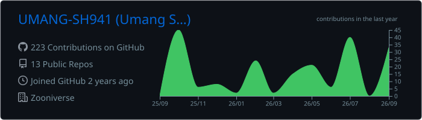

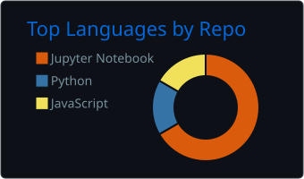
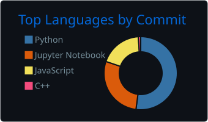
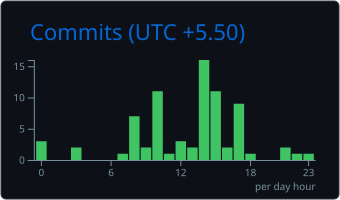

<br/><br/>


</div>

<div align="center"></div>

## `> run retro_daemon --world 4-1`

<div align="center">

<!-- Hand-built 8-bit runner: original sprite, 3-frame cycle, parallax scroll -->
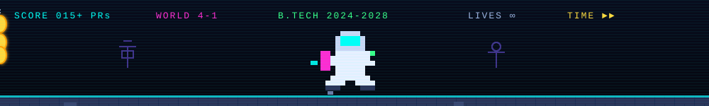

<br/><br/>

<!-- SNAKE eats the contribution grid -->
<picture>
  <source media="(prefers-color-scheme: dark)" srcset="https://raw.githubusercontent.com/UMANG-SH941/UMANG-SH941/output/snake-dark.svg"/>
  <source media="(prefers-color-scheme: light)" srcset="https://raw.githubusercontent.com/UMANG-SH941/UMANG-SH941/output/snake.svg"/>
  
</picture>

<br/><br/>

<!-- PAC-MAN eats the grid -->
<picture>
  <source media="(prefers-color-scheme: dark)" srcset="https://raw.githubusercontent.com/UMANG-SH941/UMANG-SH941/output/pacman-contribution-graph-dark.svg"/>
  
</picture>

<br/><br/>

<!-- GALAGA — fighter ship strafing the contribution grid -->
<picture>
  <source media="(prefers-color-scheme: dark)" srcset="https://raw.githubusercontent.com/UMANG-SH941/UMANG-SH941/output/galaga-contribution-graph-dark.svg"/>
  
</picture>

<br/><br/>

<!-- BREAKOUT -->
<picture>
  <source media="(prefers-color-scheme: dark)" srcset="https://raw.githubusercontent.com/UMANG-SH941/UMANG-SH941/output/breakout-contribution-graph-dark.svg"/>
  
</picture>

<br/><br/>

<!-- 3D ISOMETRIC CONTRIBUTION CITY -->


</div>

<div align="center"></div>

## `> metrics --deep-scan`

<div align="center">


<br/>


<br/>


</div>

<div align="center"></div>

## `> tail -f /dev/projects`

<div align="center">

<!--
  PINNED REPO CARDS — uncomment once these repos exist and are public.
  They 404 (broken image) if the repo name doesn't match exactly.

  <a href="https://github.com/UMANG-SH941/EvoSnap"></a>
  <a href="https://github.com/UMANG-SH941/ISRO-Radiation-Forecast"></a>
-->

</div>

### ☄️ EvoSnap — *AR sustainability scanner*
`React Native` `Expo` `TypeScript` `FastAPI` `ONNX` `MobileNetV3`

AR mobile app with a FastAPI/AI backend that pairs a vision-language model with a self-trained **MobileNetV3 classifier (TrashNet, 89% accuracy)** to identify an object and simulate its environmental decay over time. Multi-stage sustainability reasoning — carbon footprint, recyclability, decomposition timeline — with automatic fallback across three image-generation providers, offline-first persistence, and a signed Android APK release.

### ☢️ Energetic Particle Radiation Forecasting — *for ISRO GEO satellites*
`Python` `Time-Series Forecasting` `ML` `Space Weather`

Time-series forecasting of energetic particle flux to characterize the radiation environment around geostationary orbit, supporting risk assessment for onboard satellite electronics against **radiation-induced single-event upsets**.

| ▸ | PROJECT | RESULT | STATUS |
|:-:|:--|:--|:--|
| ☄️ | **EvoSnap** | 89% classifier accuracy · signed APK shipped |  |
| ☢️ | **ISRO GEO Radiation Forecast** | SEU risk characterization |  |
| 🧠 | **EEG Pipeline @ IIT Mandi** | SNR & accuracy ▲8–10% · latency ▼35% |  |
| 🗜️ | **Parameter-Efficient CNN** | 1.2M → 156K params (−87%) |  |
| 🎭 | **Affective Computing Benchmarks** | reproducible validation protocols |  |

<div align="center"></div>

## `> ls /var/trophies`

| CMD | ACHIEVEMENT |
|:--|:--|
| 🎖️ | **IEEE Student Activities Committee — Vice Chair.** Coordinating 35+ colleges across the region. |
| ⚡ | **IEEE Xtreme Competitive Programming — Top 8% globally** among thousands of international teams. |
| 📄 | **ICVGIP 2025 — Organizing Team.** Paper submissions + speaker logistics for a premier Indian CV conference. |
| 🛸 | **IETE Students Forum — Technical Lead.** Guided 50+ students in hardware-software interfacing and algorithmic design for drone development. |
| 🌍 | **Hacktoberfest 2025.** 15+ PRs — preprocessing utilities, CI pipelines, code-review workflows. |

<div align="center">

<a href="https://holopin.io/@umangsh941">
  
</a>

</div>

<div align="center"></div>

## `> ps aux | grep now_playing`

<div align="center">

<a href="https://open.spotify.com/user/31kvapwcxg7wg5jmqchrg77ev54y?si=83bc692bc9d640d8">
  
</a>
<a href="https://discord.com/users/YOUR_DISCORD_ID">
  
</a>

<br/><br/>


<!-- WakaTime: uncomment and set your handle once wakatime.com profile is public
 -->

<br/><br/>


</div>

<div align="center"></div>

## `> ping operator --open-channel`

<div align="center">

<a href="mailto:umangallac07@gmail.com"></a>
<a href="https://linkedin.com/in/umang-shukla-492144264"></a>
<a href="https://x.com/zXumangsh_"></a>
<br/>
<a href="https://www.instagram.com/retonotes_ix99/"></a>
<a href="https://www.holopin.io/@umangsh941"></a>
<a href="https://github.com/UMANG-SH941"></a>

<br/><br/>

```
  ╭──────────────────────────────────────────────────────────────╮
  │  "When you have no legacy to inherit, you create one."       │
  ╰──────────────────────────────────────────────────────────────╯
```


</div>
